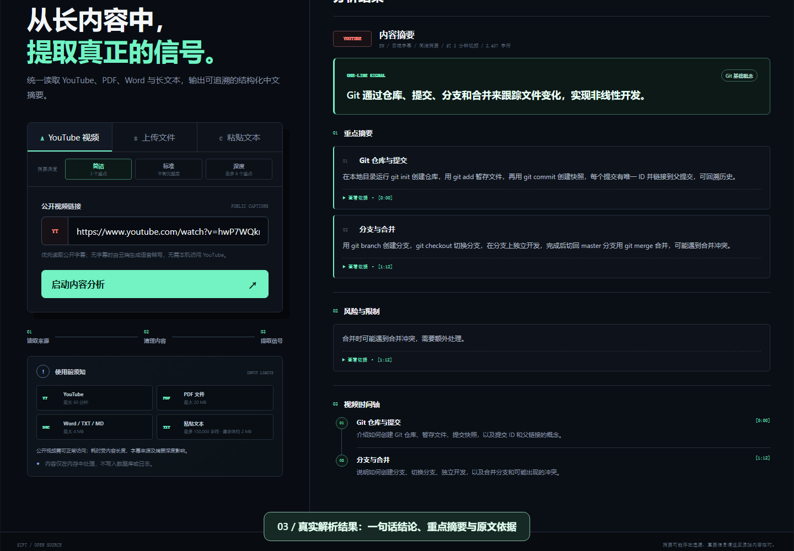

# Sift

多源内容结构化摘要工具：输入 YouTube 视频、PDF/Word 文档或长文本，生成忠于原文、可回查原文位置的中文摘要。

> 从海量内容中，留下真正重要的信息。

## 操作演示

[](docs/media/sift-youtube-demo.webm)

[▶ 观看 / 下载操作视频（约 31 秒，WebM，2.4 MB）](docs/media/sift-youtube-demo.webm) · [在线体验](https://sift-navy-six.vercel.app/)

粘贴 YouTube 链接 → 选择简洁摘要 → 真实云端解析 → 查看中文重点、依据和时间轴 → 导出 Markdown。

视频直接录自线上网站，使用 [Git in 100 Seconds](https://www.youtube.com/watch?v=hwP7WQkmECE)，带中文步骤字幕、无配音，不使用模拟结果。处理速度取决于视频、网络和服务状态；重要信息请回到原视频核验。无法直接播放时，请下载后打开。

重新录制方法及本次验证记录见 [录制说明](docs/RECORDING.md)。

## v1.0 能力

- **YouTube**：支持普通视频、Shorts 和直播回放。配置 Supadata 后，线上优先读取公开字幕，无字幕时自动生成 AI 语音转写，访客无需安装扩展、无需本机访问 YouTube；未配置时保留 YouTube 直连解析，无字幕视频可用 DeepSeek Vision 识别画面硬字幕。
- **文件**：PDF 最大 20MB，并在浏览器本地解析；DOC、DOCX、TXT、Markdown 在线上传最大 4MB。
- **文本**：最多 15 万字符，自动分段处理并合并去重。
- **摘要模型**：默认 DeepSeek，可切换 OpenAI；严格 JSON Schema + 运行时校验，格式异常时会携带具体错误进行一次定向修复。
- **摘要深度**：支持简洁、标准、深度三档，在速度、成本和信息完整度之间按场景选择。
- **成本控制**：字幕缓存 24 小时、单视频限 60 分钟、接口按单 IP 限流。
- 支持一键复制和导出 Markdown；内容仅在内存中处理，不写入数据库或日志。

统一输出：一句话结论、带原文依据的重点与关键数据、已做决定、后续行动、风险与限制，以及按顺序组织的视频时间轴或文档脉络。没有内容的区块自动隐藏；YouTube 定位可以直接跳转到对应播放时间。

## 快速开始

```bash
npm install
cp .env.example .env   # 填入 DEEPSEEK_API_KEY，线上建议再填 SUPADATA_API_KEY
npm start              # 打开 http://localhost:3000
npm test               # 运行测试
```

服务启动时自动加载根目录 `.env`；修改后需重启。Vercel 环境变量修改后必须重新部署才会生效。

## 配置

最小配置只需一个摘要模型 Key（默认 DeepSeek，设 `AI_PROVIDER=openai` 可切换）：

```dotenv
DEEPSEEK_API_KEY=your_deepseek_api_key
# 线上推荐：YouTube 字幕/转写服务
SUPADATA_API_KEY=your_supadata_api_key
```

| 变量 | 必填 | 默认值 | 用途 |
| --- | --- | --- | --- |
| `AI_PROVIDER` | 建议 | `deepseek` | 摘要模型提供方：`deepseek` 或 `openai` |
| `DEEPSEEK_API_KEY` | 是* | 无 | DeepSeek 摘要；无字幕视频的画面识别也依赖它 |
| `DEEPSEEK_MODEL` / `DEEPSEEK_BASE_URL` | 否 | `deepseek-chat` / 官方地址 | 摘要模型与接口地址 |
| `DEEPSEEK_VISION_MODEL` | 否 | `deepseek-v4-flash-vision-exp` | YouTube 画面字幕识别模型 |
| `OPENAI_API_KEY` / `OPENAI_MODEL` / `OPENAI_BASE_URL` | 用 OpenAI 时 | `gpt-5-mini` | OpenAI 摘要配置 |
| `SUPADATA_API_KEY` | 线上推荐 | 无 | Supadata Transcript API Key，配置后自动启用 |
| `YOUTUBE_TRANSCRIPT_PROVIDER` | 否 | `supadata` | 设为 `direct` 强制使用 YouTube 直连 |
| `SUPADATA_POLL_INTERVAL_MS` / `SUPADATA_POLL_TIMEOUT_MS` | 否 | `3000` / `240000` | 异步转写轮询间隔与总超时 |
| `SUPADATA_CACHE_TTL_MS` | 否 | `86400000` | 字幕缓存时长（24 小时） |
| `YOUTUBE_MAX_DURATION_MINUTES` | 否 | `60` | 单视频最大时长 |
| `YOUTUBE_RATE_LIMIT_MAX` / `YOUTUBE_RATE_WINDOW_MS` | 否 | `12` / `600000` | 单 IP 限流：时间窗内最大请求数 |
| `YOUTUBE_PROXY_URL` | 视网络 | 无 | YouTube 直连使用的 HTTP(S) 代理（优先级最高） |
| `HTTPS_PROXY` / `HTTP_PROXY` | 否 | 无 | 上述未配置时的代理回退 |
| `PORT` | 否 | `3000` | 服务端口 |

\* `AI_PROVIDER=openai` 时摘要只需 `OPENAI_API_KEY`；若还要处理无字幕 YouTube 视频的画面识别，需另配 `DEEPSEEK_API_KEY`。所有 Key 只写入本地 `.env` 或平台环境变量，不要提交到 Git。

## YouTube 解析

### 线上：Supadata（推荐）

Vercel 直连 YouTube 容易被风控拦截。[Supadata](https://supadata.ai) 作为字幕/转写中转服务，由服务端调用，不受部署环境影响：

1. 在 <https://supadata.ai> 注册并获取 API Key。
2. 在 Vercel 环境变量中配置 `SUPADATA_API_KEY` 后重新部署。
3. 删除 Vercel 上的 `YOUTUBE_PROXY_URL` 等本机代理变量（线上指向云函数自身，无效）。

运行优先级：**Supadata**（先 `native` 读公开字幕，无字幕自动降级 `auto` 生成语音转写；长视频异步轮询直至完成、失败或超时）→ 临时失败时回退 **YouTube 直连** → 仍失败则提示可选装 **Sift Browser Helper**。未配置 Key 或 `YOUTUBE_TRANSCRIPT_PROVIDER=direct` 时只走直连。

**成本**：原生字幕约 1 credit/次，AI 转写约 2 credit/分钟（以官方定价为准）。缓存、时长上限和限流见「配置」表；缓存为实例内存，Serverless 多实例不共享。Supadata 仅在服务端调用，Key 不会出现在浏览器源码、Network 请求或 Git 仓库中。

### 本地：直连与代理

本地默认走 YouTube 直连。浏览器代理插件不作用于 Node，本机无法直连时在 `.env` 配置：

```dotenv
YOUTUBE_PROXY_URL=http://127.0.0.1:1087
```

云端的 `127.0.0.1` 指向云函数自身；Sift 在 Vercel 上检测到 loopback 代理会自动忽略并直连，`/api/health` 的 `youtube` 字段可查看代理状态与字幕 Provider。

### 备用：Sift Browser Helper

云端全部失败、而本机 Chrome 可访问 YouTube 时，可在 `chrome://extensions/` 开启开发者模式并加载本仓库的 `browser-helper` 目录，刷新页面后重新提交。助手只响应 Sift 生产与本地地址，不会发送 YouTube Cookie 或账号信息；ChatGPT/Codex 等插件不具备所需协议与权限，无法替代。

## API

| 方法 | 路径 | 输入 |
| --- | --- | --- |
| `GET` | `/api/health` | 无 |
| `POST` | `/api/summarize/youtube` | JSON：`{ "url": "..." }`（NDJSON 流式返回阶段进度与结果） |
| `POST` | `/api/summarize/youtube-browser` | 浏览器助手内部接口 |
| `POST` | `/api/summarize/file` | multipart/form-data：字段名 `file` |
| `POST` | `/api/summarize/file-text` | 浏览器解析 PDF 后提交提取文本 |
| `POST` | `/api/summarize/text` | JSON：`{ "title": "...", "text": "..." }` |

## v1.0 边界

- 无字幕视频：配置 Supadata 时生成 AI 转写，失败会明确提示「暂时无法生成该视频的字幕」，不伪造结果；未配置时只能识别画面硬字幕，纯语音视频无法处理。
- 单视频最长 60 分钟；额度不足、转写超时、视频不可访问等均有明确错误提示。
- 每次处理一个来源，不保存历史，不合并多来源。
- 复杂排版、扫描版 PDF 和图片文字可能无法提取。
- 内容会发送至配置的模型服务，请勿提交无权处理的敏感内容。

## Roadmap

- `v1.1`：YouTube 频道地址与最新视频批量摘要
- `v1.2`：邮件文件与更完整的文档解析
- `v1.3`：Gmail 指定邮件自动读取
- `v2.0`：历史记录、定时生成和多来源合并

## License

MIT
