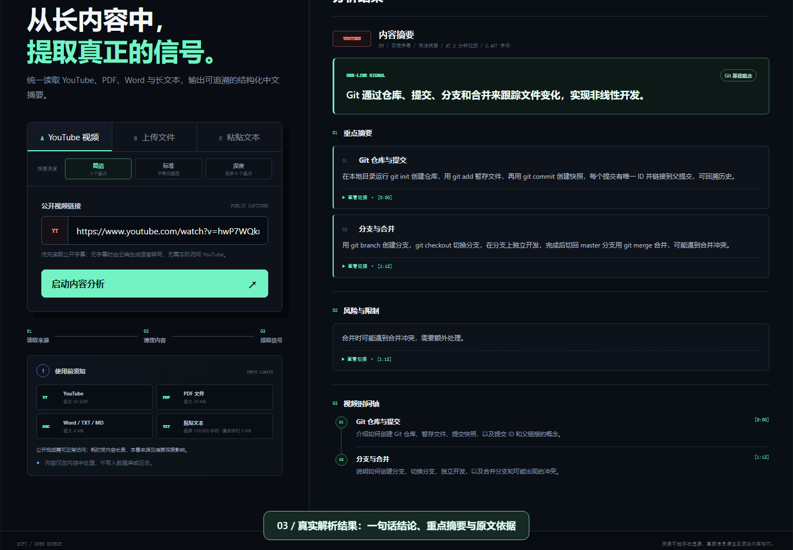

# Sift

从 YouTube 视频、PDF/Word 文档和长文本中提取关键信息，生成可回查原文的结构化中文摘要。

## 操作演示

[](docs/media/sift-youtube-demo.mp4)

[观看操作视频](docs/media/sift-youtube-demo.mp4) · [在线体验](https://sift-navy-six.vercel.app/)

粘贴链接或导入内容 → 选择摘要深度 → 查看重点、依据和时间轴 → 导出 Markdown。

## 功能

- **多源输入**：YouTube 视频、PDF、DOC/DOCX、TXT、Markdown 和粘贴文本。
- **结构化摘要**：提炼结论、重点、关键数据、决定、行动及风险，支持简洁、标准、深度三档。
- **原文溯源**：核验引文是否出现在对应段落、PDF 页或视频时间点，并展示上下文；不等同于证明结论正确。
- **模型与导出**：默认使用 DeepSeek，可切换 OpenAI；支持复制和 Markdown 导出。
- **受控工作流**：长内容分块提炼与合并，结构和引文校验最多修复一次；展示调用、耗时和实际 token 用量。

## 快速开始

推荐 Node.js 22 或更高版本。

```bash
npm install
cp .env.example .env
```

在 `.env` 中填写模型 Key；线上解析 YouTube 建议同时配置 Supadata：

```dotenv
DEEPSEEK_API_KEY=your_deepseek_api_key
SUPADATA_API_KEY=your_supadata_api_key
```

```bash
npm start
```

打开 [localhost:3000](http://localhost:3000)。运行测试使用 `npm test`。

完整配置见 [.env.example](.env.example)。使用 OpenAI 时设置 `AI_PROVIDER=openai` 和 `OPENAI_API_KEY`；修改本地环境变量后需重启服务。

## 部署与 YouTube 解析

在 Vercel 导入仓库，配置模型 Key 和 `SUPADATA_API_KEY` 后部署；修改环境变量后需重新部署。

- **线上**：配置 [Supadata](https://supadata.ai) 后优先读取公开字幕，无字幕时尝试语音转写。访客无需安装扩展，解析仍受视频可访问性、服务额度和超时限制。
- **本地**：未配置 Supadata 时使用 YouTube 直连。需要代理时设置 `YOUTUBE_PROXY_URL`；浏览器代理插件不会自动作用于 Node.js。
- **代理配置**：不要在 Vercel 上填写 `127.0.0.1` 或 `localhost` 代理地址，它们指向云函数自身。
- **备用方案**：云端解析失败时，可使用 [Sift Browser Helper](browser-helper/README.md)。
- **超时**：Vercel 下字幕读取/转写最多等待 25 秒，摘要使用剩余请求预算；较长转写可能失败，不保证所有视频可解析。

## 使用限制

- PDF 最大 20MB，在浏览器解析；其他文件在线上传最大 4MB；文本最多 15 万字符，视频默认最长 60 分钟。
- 每次处理一个来源，不保存历史；字幕缓存和所有摘要接口的 IP 限流基于实例内存，多实例不共享。
- 扫描版 PDF、复杂排版及不可访问的视频可能无法解析。重要结论请回查原文。
- 内容会发送至配置的模型或转写服务，API Key 应保存在本地 `.env` 或平台环境变量中。

## 验证与设计

`npm test` 不消耗模型额度。`npm run eval:model` 使用合成内容，最多调用模型 10 次（含修复与合并），会消耗 API 额度，报告生成到 `artifacts/`。

[设计与面试讲解](docs/INTERVIEW.md) · [验证记录与边界](docs/VALIDATION.md)

## License

MIT
